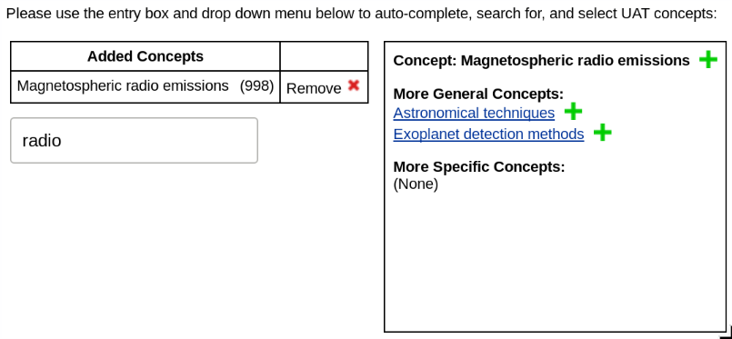

# uat-chooser

A widget for choosing concepts from the
[Unified Astronomy Thesaurus](http://astrothesaurus.org/). It currently looks
like this:



The original code was donated by [eJournalPress](https://ejpress.com/). This
module is maintained by the [American Astronomical Society](https://aas.org/).


## Usage

See [dist/index.html](dist/index.html) for a minimal example webpage that will
demonstrate the concept chooser.

We don’t currently host a world-accessible version of the UAT chooser, so if
you want to embed it in your own website, you must build and upload it
yourself. To do so, run

```
$ npm install
$ npm run build
```

and then copy the contents of the `dist/` directory, minus `index.html`, to
your web server. Tweak the sample HTML and embed it in your webpage as
appropriate.

**TODO**: show how to extract the list of selected keywords!


## Technical details

The widget is based on the [script.aculo.us](https://script.aculo.us/)
library, which in turn is built on the [Prototype](http://prototypejs.org/)
framework. These are both rather out-of-date compared to current JavaScript
trends.

In a perhaps vain effort to adapt the code to a more modern JavaScript style,
I ([@pkgw](https://github.com/pkgw)) have made some efforts toward wrapping
the widget in a standard [npm](https://www.npmjs.com/) package using
[webpack](https://webpack.js.org/). However, the Prototype library makes
various modifications to the global JavaScript interpreter namespace, so (as
far as I can tell) this package can’t be transparently integrated into a
regular Web dependency stack so long as it remains built on script.aculo.us.
(Prototype makes some gnarly use of
[arguments.callee](https://developer.mozilla.org/en-US/docs/Web/JavaScript/Reference/Functions/arguments/callee)
that further mean that we can’t run in Strict mode.)

What I’ve set up here is an `npm run build` command that will combine the
widget code with the script.aculo.us modules that it uses. That way, the only
special thing you need to do is to make sure to load `prototype.js` before
loading this package.

The main output file created by the `npm run build` command is
`dist/uat-chooser.js`. This module is built in Webpack’s
[library mode](https://webpack.js.org/configuration/output/#output-librarytarget),
so that if you load it in a webpage it will create a global variable named
`uat_chooser` that represents the module. That module currently has one API
entry point, `uat_chooser.default.ejpUatAutocompleterInit(divid)`. This
function takes the ID of a `<div class="uat-widget">` element that will be
set up with the UAT concept-choosing interface.


## Legalities

The original code was donated by Precision Computer Works, Inc. /
eJournalPress to the American Astronomical Society. Licensed under the MIT
License.
